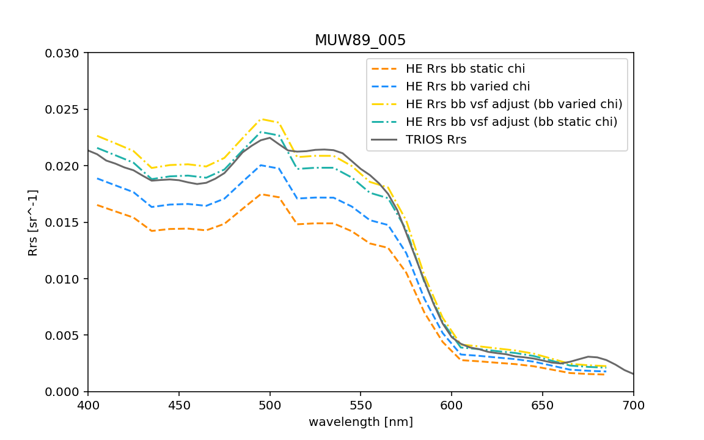

# HydroLight Lab

## 1. Getting to know HydroLight-EcoLight

### Demo walk-through of a HydroLight run

#### Implementing a HydroLight run
1. Open the GUI and hit "Continue"
2. Enter a root name and short description in the relevant boxes
3. Look at the "Run Parameters" and "Physical Parameters", but leave as default
4. Hit "OK" on the Notice
5. Select "Classic Case 1 IOPs"
6. Select "Click here to specify component IOPs"
7. Select "Click here to specify pure water IOPs" and leave the default selected (select "Return")
8. Select "Continue"
9. Choose a chlorophyll concentration and phase function (keep as "dfp_Petzold_avg_particle.txt") and select "Continue"
10. Don't include any inelastic scattering (select "Continue" without changing anything)
11. Set-up a multi-wavelength run, from 400 to 700 nm, with a 10 nm bandwidth, then select "Continue"
12. Leave all Air-Water surface boundary conditions as defaults
13. Set the solar zenith angle to 30 and cloud cover to 0
14. Take the annual average for the earth-sun distance and ozone climatology
15. Use RADTRAN-X for the incident light sky model, with the angular pattern of the sky radiance as hcnrad
16. Set your water column to be infinitely deep
17. Enter a list of output depths as follows: 0, 1, 2
18. Select "Change Output Options" and select "Standard Printout" and "Check here to generate file (Mroot.txt) and corresponding Excel spreadsheet" and "Check here if you want a notice box to appear when the batch runs is complete"
18. Optional: Select "Click here to save this input as the default values for the next run"
19. Select "Begin Hydrolight Batch Run Now" and select "Continue"
20. Select "Begin Ecolight Batch Run Now" and select "Continue"

#### Looking at the results

1. Navigate to where HydroLight is installed on your computer in Finder / File Explorer
2. Look in the `output > HydroLight` and the `output > EcoLight` folders
3. The printout file contains all the run details, as well as all of the output. Very useful, but the data are not very human or computer-readable
4. The Excel file (and corresponding text file) is more readable, but doesn't contain all the run details

**Question:**

What is the difference between the HydroLight and EcoLight runs? Why is this?

### Exercise

Do five different HydroLight or EcoLight runs where you adjust some of the input parameters and compare the output. 

Use any of the following IOP models: CLASSIC CASE 1 IOPs, NEW CASE 1 IOPs, CASE 2 IOPs, NEW CASE 2 IOPs.

What differences did you expect to see? Did your prediction hold? Can you explain the differences in the output for each of the runs?

Examples:
1. How does the remote sensing reflectance change for different solar zenith angles?
2. What impact does the phase function have on the diffuse attenuation coefficient?
3. How does increasing minerals impact the remote sensing reflectance?
4. Imagine you are on an ocean world different from our own (e.g., the water is much warmer, or more saline, the ocean is a liquid with a different refractive index, the ocean is very shallow)

## 2. Can I use my own IOPs?

**Purpose:** Calculating the light field for modeled IOP data or IOPs measured in situ.

### Example from the Iceland Basin

The above figure shows the remote sensing reflectance (Rrs) at one station in the Iceland Basin. The solid line (trios) is Rrs measured in situ from a surface floating radiometry system. The dashed lines were all created with EcoLight. The IOPs used as input to EcoLight were collected as follows: absorption is from a PSICAM, scattering is from an ac-s, and backscattering is from a hyper-bb combined with (for some of the runs) an ECO-VSF. The difference between each of the EcoLight runs is how we corrected our in situ data. By doing this type of analysis, we can get a handle on how well our IOP measurements match our AOP measurements, and we can explore different IOP correction methods.

### a. With the GUI

Step through the MEASURED IOPs options and run EcoLight. Some specifics:
1. Give this run a new name and description.
1. Do a two component model
2. HE (HydroLight-EcoLight) needs an ac file as input i.e., a file that contains absorption and attenuation data *with water values removed*. Use the example file ac_OOclass_uIOP_GUI.txt.
3. For the phase function, we're going to use a Fournier-Forand phase function selected based on the bb/b value. In this case, we have measured bb data, so we'll provide HE a bb file (last option on the GUI). Use the example file bb_OOclass_uIOP_GUI.txt - this file *does NOT contain pure water*.
4. Don't include inelastic scatter or bioluminescence
5. Set-up a multi-wavelength run, from 400 to 700 nm, with a 10 nm bandwidth
6. Keep the sky / atmosphere as defaults
6. Set your water column to be infinitely deep
7. Enter a list of output depths as follows: 0, 1, 2
8. Submit an EcoLight run

### b. Without the GUI

We can actually run HE without using the GUI at all. When we step through the GUI an input file is made (`Iroot.txt`) - let's check what our `IOOclass_uIOP_GUI.txt` file looks like.

We're now going to make the same Iroot file, but manually (or at least, with the help of Python).

Open (& run) `01-Create-HE-Iroot-file.ipynb`.

The final step is to actually submit this run. First, we need to copy the input file and runlist to the relevant place on our computer:

- the HE input files needs to be copied to `C:\HE60\run\batch` (or similar)
- the runlist file needs to be copied to `C:\HE60\run\` (or similar)

And then to run EcoLight, double click on the `run_el` application in `C:\HE60\frontend`. 

**Question:**

Does the output from using the GUI match the output from this run?

## 3. Submit LOTS of runs aka "batch run"

One of the benefits of HE is being able to build a synthetic dataset. 
Imagine you had a bio-optical model where your constituents were CHL and CDOM,
and you wanted to generate Rrs spectra for a range of CHL and CDOM values.
You could step through the GUI manually entering everything, then run HE. 
This could take a long time depending on how many different combinations of CHL
and CDOM you have. 

OR you could use e.g., Python, to create all your input files, and then run all 
your input files at once.

We're going to use Python to create 24 sets of input files and submit these through
a HE batch run.

Open and run `02-Batch-create-HE-inputs.ipynb` to create all the input files.

Then, as before, copy the files to the appropriate places and run EcoLight, i.e., 

Copy the input file and runlist to the relevant place on our computer:

- the HE input files needs to be copied to `C:\HE60\run\batch` (or similar)
- the runlist file needs to be copied to `C:\HE60\run\` (or similar)

And then to run EcoLight, double click on the `run_el` application in `C:\HE60\frontend`.

### Exercises

1. How do each of the batch runs differ from each other in terms of:
     1. the absorption coefficient at the surface
     2. the scattering coefficient at the surface
     3. the remote sensing reflectance?

2. Ask yourself a question that you could answer / explore by creating your own batch run where you adjust some of the inputs and compare the output. You can compare the output within your batch run, but also with the example batch run we just did. What did you find using HE? What differences do you see between the HE runs? Can you explain your results? Example questions:
     1. What happens if you use a different bio-optical model, with the same OSM ranges? How different are the IOPs, and the resulting underwater light field (Rrs, Kd, etc)?
     2. What value does the constant of proportionality take between Rrs and (bb/a+bb) for a range of solar angles? (i.e., estimate the value of "G" from this morning's lecture on the RTE and the final result of the QSSA)
     3. Imagine you are on an ocean world different from our own (e.g., the water is much warmer, or more saline, the ocean is a liquid with a different refractive index, the ocean is very shallow), could you detect the concentration of chlorophyll using the standard NASA product for Earth? 

**Note:** There's a notebook in the Lab folder that reads the Rrs data from all the output printout files (rather than the Excel files) - `Read-HE-output.ipynb`. It's old, and it may be more efficient for you to write your own code to read data from the Excel files (depending on what you are doing). But if you do want Rrs data, the code does work, and it could be tweaked to also read out other variables. 